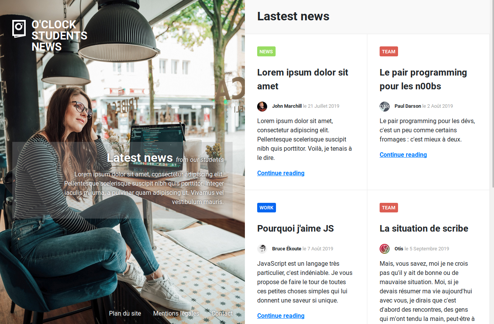

# oNews

O'Clock sort son journal d'étudiants :muscle:

Votre mission, si vous l'acceptez (...pfff évidemment qu'on l'accepte ), sera d'intégrer la maquette du site.

## Charte

### Visuels

Le dossier `images` contient tous les visuels nécessaires pour cette intégration.

_Ne vous préoccupez pas pour l'instant du contraste des textes sur l'image :wink: Ça fera l'objet d'un bonus_ :skull:

### Couleurs

- Liens article : #007bff
- Liens article survol : #0056b3
- fond header : #f9f9f9
- bordure d'article : #eaeaea
- WORK : #0766F0;
- TEAM : #DC5E53;
- NEWS : #98DC62;

### Font

Choix libre mais de type sans-serif

## Bonus "lisibilité" :white_flower:

Si vous avez lu tout l'énoncé, vous savez ce qu'il vous reste à faire ;-)
- Trouvez les propriétés et valeurs CSS idéales pour que le cadre transparent derrière le texte central bouge harmonieusement lorsque vous modifiez la taille de la fenêtre
- Identifiez un moyen de faire ressortir les liens en bas de la page sur le fond clair

## Bonus "défilement" :skull:

- il y a une scrollbar à droite, et désormais on en tient compte :boom:
- la page contient en tout 6 articles, même si seuls 4 sont visibles
- lorsqu'on fait défiler la page pour voir les 2 articles suivants :
  - la partie de gauche ne bouge pas, elle reste figée
  - le scroll fait descendre la partie droite et affiche les 2 articles suivants