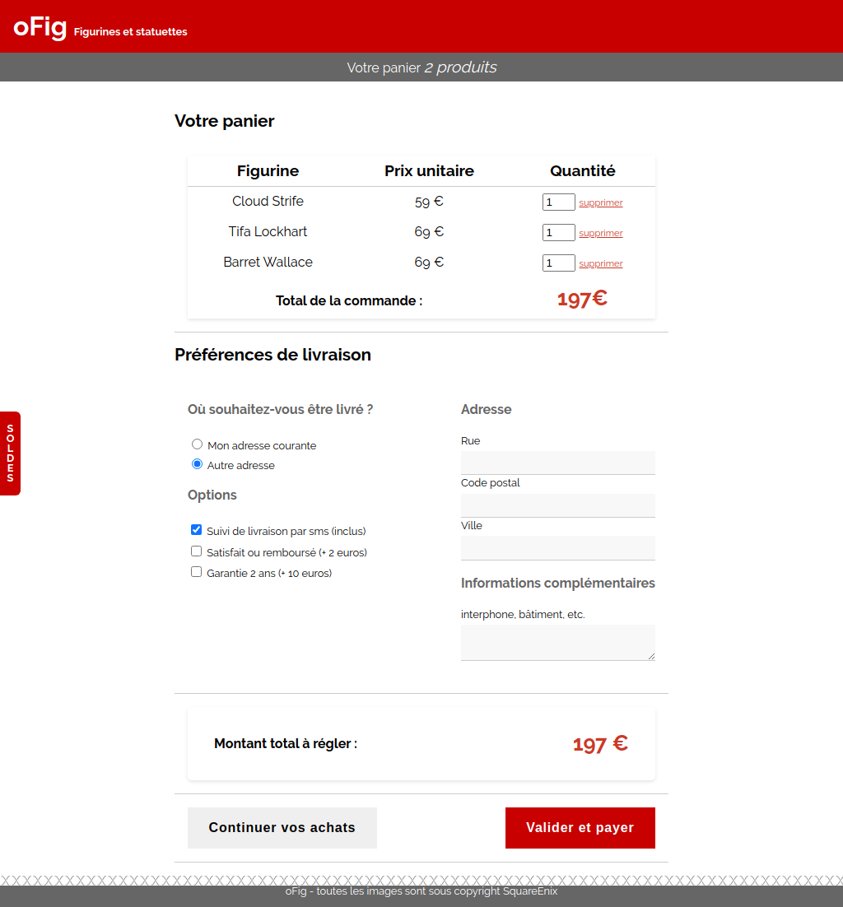

# oFig - Panier

Vous vous souvenez de oFig ? Avec les petites figurines ? Bon et bien continuons alors :) 

## Objectif

Réaliser la page avec le formulaire de livraison du site

On s'occupe avant tout du formulaire (_les styles des radios et des checkboxes peuvent varier d'un navigateur à l'autre, on ne va pas les customiser ici_)

Je vous propose de reprendre le code la boutique fait ensemble, vous aurez images et css de base pour repartir sur de bonnes bases.

Bon courage ;)

## Bonus

Rappel : les bonus sont FACULTATIFS

Pour la partie "Votre panier", vous aurez besoin d'utiliser la balise [table](https://developer.mozilla.org/fr/docs/Web/HTML/Element/table) et tous ses copains (`tr`, `td`, `thead`, `tbody`, `tfoot`...)

Vous pouvez vous aider de [cette page](https://developer.mozilla.org/fr/docs/Apprendre/HTML/Tableaux/Basics) pour mieux comprendre comment tout ça s'utilise !

## Bonus (encore !)

Rappel : les bonus sont toujours FACULTATIFS

Trouvez un moyen de griser une ligne sur deux dans le tableau, en une seule instruction CSS !

