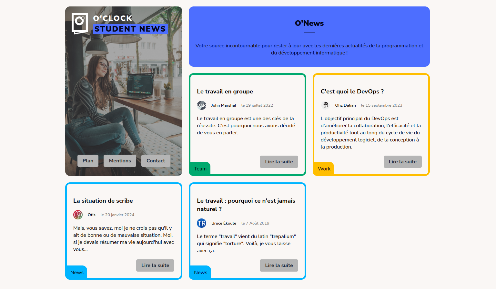
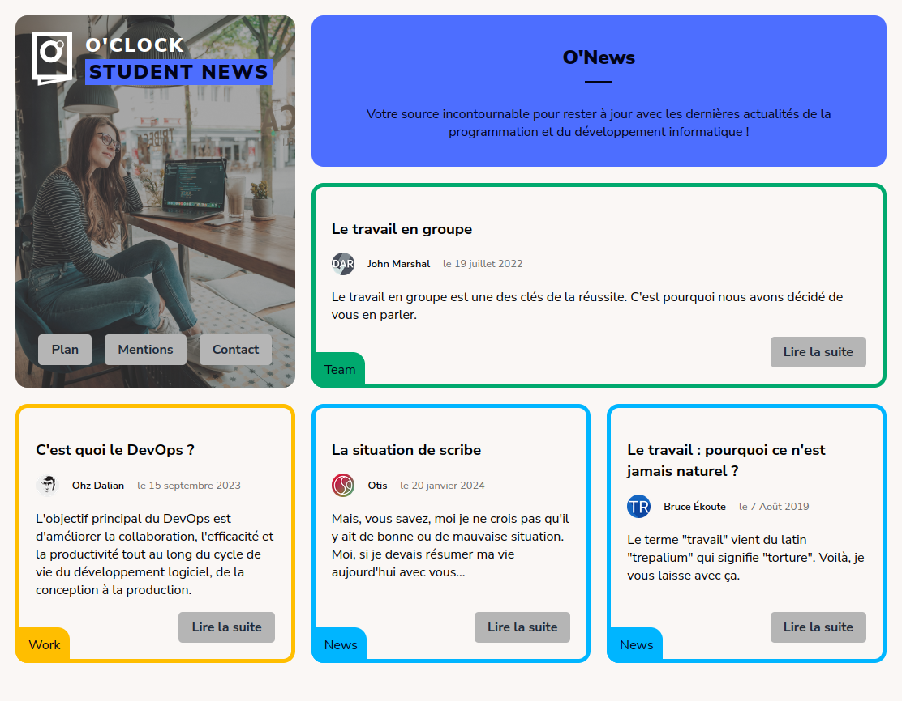

# oNews - le retour !

Nicole est de retour pour te jouer un mauvais tour !

La première version d'oNews était sympa, mais ce serait top si on pouvait y ajouter une touche de responsive, et pourquoi pas utiliser Grid ?

Cette fois-ci, une partie de l'intégration a été réalisée pour te permettre de te concentrer sur les nouveautés du jour.

⚠️ **Ici, pas besoin de toucher au HTML, tout doit pouvoir se faire directement dans le CSS !**

🔍 **Pense à utiliser les outils de développement, c'est indispensable pour s'y retrouver, surtout dans le code de quelqu'un d'autre**

## Étape 1 - Mettre en place Grid

Pour afficher les éléments (ou _bentos_) de manière un peu plus ordonnée, il faut utiliser Grid.

Concentre-toi en premier sur la version desktop et essaye de disposer les éléments comme présenté ci-dessous :

    
Besoin d'aide ?

    <ul>
        <li>Essaye de visualiser les éléments comme s'ils devaient se positionner dans une grille.</li>
        <li>Si besoin, tu peux tracer les lignes et colonnes sur l'image pour t'aider.</li>
        <li>Comme Grid est encore tout frais, <a target="_blank" href="https://grid.layoutit.com/">cet outil bien pratique</a> peut t'aider à trouver les bonnes propriétés à utiliser.</li>
    </ul>

## Étape 2 - Décliner pour tablette / laptop

**Règle** : largeur max. 1170px

Utilise les règles media dans le CSS pour mettre en place la version tablette/laptop ci-après :

➡️ Si tu as un oublié la syntaxe des règles media, ça tombe bien, quelqu'un en a laissé un exemple tout à la fin du fichier CSS 👀

## Étape 3 - Décliner pour grand mobile

**Règle** : largeur max. 940px

Utilise les règles media dans le CSS pour mettre en place la version mobile ci-après :

## Étape 4 - Décliner pour petit mobile

**Règle** : largeur max. 560px

Utilise les règles media dans le CSS pour mettre en place la version mobile ci-après :

