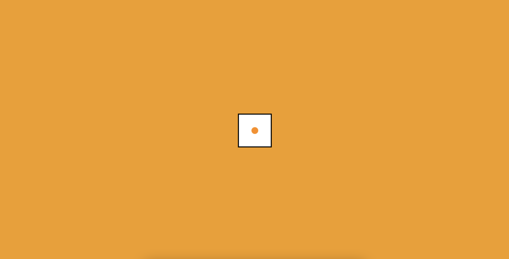
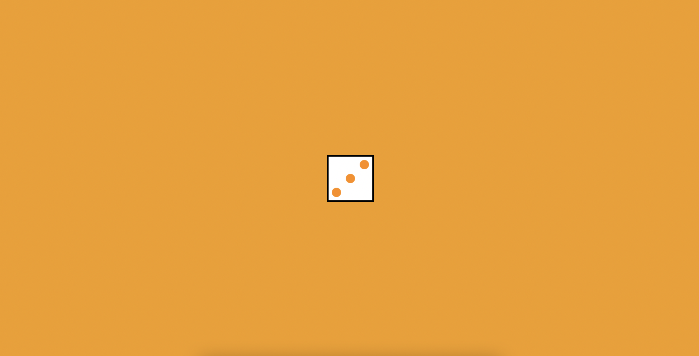
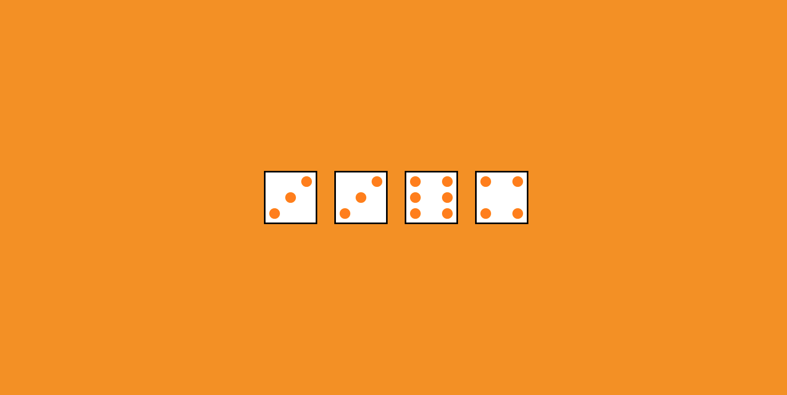
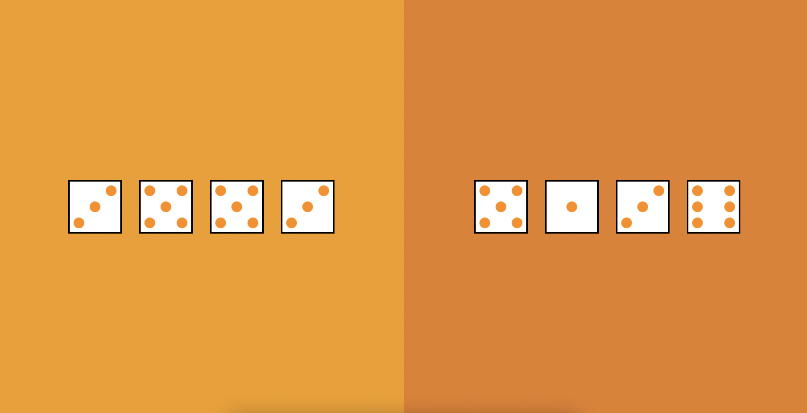

# Dice roller

:game_die: Cette fois-ci on va créer un programme pour lancer des dés. C'est parti ! :game_die:

## Commençons par créer un dé

On va créer un dé en JavaScript :
- Dans `app.js`, créons tout d'abord une `div`.
- On va ajouter une classe `dice` à cette `div`.
  - _Eh, ça tombe bien_ ! Tous les styles (y compris `.dice`) sont déjà _définis_ dans `styles.css` pour dimensionner et appliquer une image d'arrière-plan à l'élément qui porte cette classe.
  - _Tiens d'ailleurs_ ! L'image appliquée en arrière plan est ce qu'on appelle un **sprite** : c'est une image comportant en fait plusieurs images. On n'affichera qu'une partie de l'image en arrière plan. Et jouant sur la position de l'arrière-plan, on affichera telle ou telle portion de l'image (en partie 2). Les sprites, c'est très pratique pour ne charger qu'une seule image au lieu de plusieurs et améliorer ainsi l'expérience utilisateur.
- On n'a plus qu'à insérer la `div` créée dans le DOM. Il faudrait l'ajouter dans la `div` déjà présente qui possède l'id `player`.

✔ Checkpoint : lorsque cette étape est validée, la page pourrait bien ressembler à ça !

## Tirer un nombre aléatoire

Bon c'est bien beau tout ça mais ça me tire que des 1 pour le moment, je risque pas de gagner :confounded:

- On ajoute une fonction pour tirer un nombre aléatoire entre 1 et 6
- On se sert du nombre obtenu pour modifier la position de l'arrière plan du dé  
Pour info chaque face de dé fait exactement 100px de large sur le sprite ;)

✔ Checkpoint : lorsque cette étape est validée, la page pourrait bien ressembler à ça !

## Lancer plusieurs dés

Chouette on y est presque ! Maintenant faudrait lancer plusieurs dés.

- Il faudrait demander à l'utilisateur de saisir combien de dés il veut lancer lorsqu'il arrive sur la page.
- On pourrait créer une fonction contenant les instructions permettant la création d'un dé. Ca tombien bien, on a déjà écrit ces instructions !
- Et enfin executer la fonction autant de fois que de dés demandés par l'utilisateur.

✔ Checkpoint : lorsque cette étape est validée, la page pourrait bien ressembler à ça !

---

  Bonus <strong>facultatif</strong>

## Ajouter un adversaire

On va faire un deuxième lancer aléatoire

- On ajoute une `div` après la `div` possédant l'id `player`, on lui met une classe `board` et un id `dealer`. 
  - Note: on peut le faire en HTML, mais ce n'est pas interdit de le faire en JavaScript pour s'entraîner !
  - Si tout va bien on doit voir 2 zones oranges prenant chacune la moitié de l'écran.
- L'objectif est de générer un tirage dans la zone du joueur ET un tirage dans la zone du dealer:
  - On pourrait pour cela ajouter un paramètre à notre fonction de génération de dé pour récuperer l'id de l'élément à cibler : soit la `div` avec l'id `player`, soit celle avec l'id `dealer`.

✔ Checkpoint : lorsque cette étape est validée, la page pourrait bien ressembler à ça !

