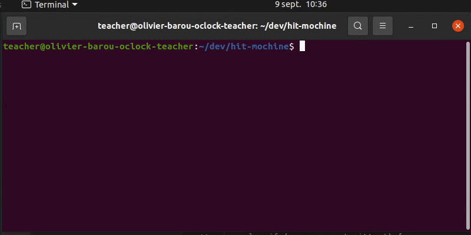

# Hit MO'chine

On vient d'avoir Charlu et Lili au téléphone. Ils veulent un outil en ligne de commande pour afficher les 10 premières entrées du hit-parade. Oui, nous aussi on a trouvé cette demande un peu bizarre, mais bon, allons-y !

<details>
<summary>Cliquez pour voir à quoi devrait ressembler votre application</summary>



</details>

## Énoncé débrouillard

Faire en sorte que le programme en node.js `index.js` écrive dans la console `Que souhaitez vous ?`.

En utilisant le système événementiel, si l'utilisateur écrit :

- `chante` : afficher `Je m'appelle Charlu, je m'appelle Lili, vous êtes chez O'clock` dans la console.
- `classement` : afficher les 10 premières entrées du Top 50 en utilisant le tabeau fourni.
- `quitter` : arrêter le programme.

## Bonus

(Rappel, les bonus ne sont pas corrigés en cours, ils sont juste là pour se confronter à des problèmes)

On va rajouter une commande "position n" à notre programme, où n est un entier compris entre 1 et 10. Quand un utilisateur saisira par exemple "position 5" notre programme affichera l'entrée 5 du classement (Kids United - On écrit sur les murs)

## Énoncé guidé

↓

↓

↓

↓

↓

↓

↓

↓

↓

↓

↓

↓

↓

Durant les premières étapes, vous allez avoir à stopper et relancer vous même le programme pour reposer la question. Pour arreter votre programme : <kbd>Ctrl</kbd> + <kbd>c</kbd>.

Rappel pour exécuter votre programme : `node index.js`.

### 1 - Écrire dans la console

Commencez par créer un petit programme qui affiche dans la console `Que souhaitez vous ?`. 

Étant donné que l'on va poser plusieurs fois la question, on va tout de suite ranger ce code dans une fonction. Écrivez une fonction nommée `poseQuestion()` qui affiche dans la console `Que souhaitez vous ?`, avec un `console.log()`. 

Après avoir défini la fonction, exécutez là. On teste, on commit et on push.

### 2 - Lire ce qu'écrit l'utilisateur

Ok, on est capable d'écrire dans la console, mais ce qui serait encore mieux ce serait de pouvoir lire ce qu'écrit l'utilisateur dans la console.

Ajoutez à la suite du programme un écouteur d'évenements qui va exécuter un bout de code à chaque fois que l'utilisateur saisira une ligne de texte dans la console.
On va dans un premier temps seulement ré-afficher ce qu'a saisi l'utilisateur.

Il y aura 3 étapes à réaliser :
- Importer le module `readline`
- Créer une interface (voir la doc https://nodejs.org/api/readline.html#readline_readline_createinterface_options surtout l'exemple proposé ;))
- Ajouter l'écouteur d'évènements (https://nodejs.org/api/readline.html#readline_event_line). 

<details>
<summary>Cliquez pour voir à quoi devrait ressembler votre code</summary>

```
Import du module "readline"

Creation de l'interface grace au module readline.

Création du teableau avec toutes les entrées du Hit-MO'chine

A chaque fois que l'utilisateur saisi une ligne de texte {
   -> Ré-affichage de la ligne saisie
}

```
</details>

On teste, on commit et on push.


### 3 - Faire chanter Charlu et Lili

Modifiez la fonction de callback qui traite la saisie de l'utilisateur pour qu'elle fasse le traitement suivant : 
```
si la saisie est égal à "chante"
    -> afficher `Je m'appelle Charlu, je m'appelle Lili, vous êtes chez O'clock.`
sinon
    -> afficher `Je n'ai pas compris votre demande.`
```
On teste, on commit et on push.

### 4 - Rajouter une commande supplémentaire à notre programme

Entre le `if` et le `else` de l'étape précédente, ajoutez un `else if` pour afficher le classement. Dans un premier temps, affichez juste `TODO: Afficher le classement` dans la console.
```
si la saisie est égale à "chante"
    -> afficher `Je m'appelle Charlu, je m'appelle Lili, vous êtes chez O'clock.`
sinon, si la saisie est égale à "classement"
    -> afficher `TODO: Afficher le classement`
sinon
    -> afficher `Je n'ai pas compris votre demande.`
```
On teste, on commit et on push.

### 5 - Afficher le classement

Remplacez le `console.log('TODO: Afficher le classement')` par une boucle qui va parcourir le tableau pour en afficher tous les éléments (Doc : https://developer.mozilla.org/fr/docs/Web/JavaScript/Reference/Statements/for...of). On commit et on push.

### 6 - On exploite notre fonction à 100%

Bon, ça fonctionne. On demande quelque chose à notre utilisateur. En fonction de ce qu'il saisit dans dans la console, notre programme affiche l'information demandée.
Mais, histoire d'être au top niveau ergonomie, il serait bien de faire en sorte que le programme nous repose la question `Que souhaitez vous ? ` lorsqu'il a traité la réponse de l'utilisateur.
Dans chaque bloc `if/else`, après avoir répondu à l'utilisateur, faites en sorte de ré-écrire la question dans le terminal, peut être en rappelant la fonction créée précédement ;).

<details>
<summary>Cliquez pour voir à quoi devrait ressembler votre code</summary>

```
poseQuestion() {
    afficher "Que voulez vous ?"
}

A chaque fois que l'utilisateur saisi une ligne de texte {
    si la ligne est égale à "chante"
        -> afficher "Je m'appelle Charlu, je m'appelle Lili, vous êtes chez O'clock."
        -> appeler la fonction poseQuestion()
    sinon, si la réponse est égale à "classement"
        -> affichage du classement avec une boucle
        -> appeler la fonction poseQuestion()
    sinon
        -> afficher "Je n'ai pas compris votre demande."
        -> appeler la fonction poseQuestion()
}
```
On teste, on commit et on push.

</details>

### 7 - Et oui, mais et pour quitter ?


Si tout va bien, vote programme devrait reposer immédiatement la question après avoir traité la réponse de l'utilisateur. C'est chouette mais le programme ne s'arrete jamais :scream:. Pour résoudre cela, rajoutez encore un `else if` pour gérer le cas où l'utilisateur nous répond `quitter`. Pour que le programme se quitte, il faut refermer l'interface qu'on a créé avec le module `readline` (La doc : https://nodejs.org/api/readline.html#readline_readline). 
On teste, on commit et on push.
