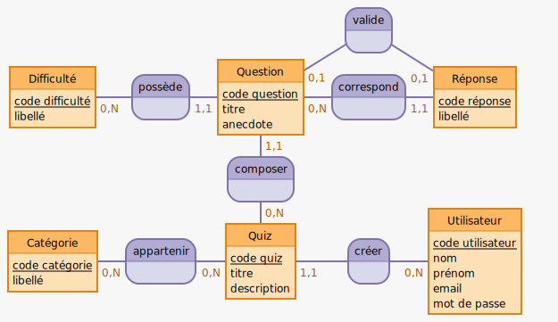

# MCD

## Etape 1 : les entités

- Quiz
- Utilisateur
- Question
- Réponse
- Catégorie
- Difficulté

## Etape 2 : attributs des entités

- Quiz :
  - titre,
  - description
- Utilisateur :
  - nom,
  - prénom,
  - email,
  - mot de passe,
- Question :
  - titre,
  - anecdote,
- Réponse :
  - libellé,
- Catégorie :
  - libellé
- Difficulté :
  - libellé

## Etape 3 : discriminant des entités

- Quiz :
  - code quiz
- Utilisateur :
  - code email
- Question :
  - code question
- Réponse :
  - code réponse
- Catégorie :
  - code catégorie
- Difficulté :
  - code difficulté

## Etape 3 : associations

```txt
:
:
valide, Question, Réponse

Difficulté : code difficulté, libellé
possède, Question, Difficulté
Question : code question, titre, anecdote
correspond, question, Réponse
Réponse : code réponse, libellé
:

composer, Quiz, Question
:

Catégorie : code catégorie, libellé
appartenir, Catégorie, Quiz
Quiz : code quiz, titre, description
créer, Utilisateur, Quiz
Utilisateur : code utilisateur, nom, prénom, email,mot de passe
```

## Etape 4 : cardinalités

```txt
:
:
valide, 01 Question, 01 Réponse

Difficulté : code difficulté, libellé
possède, 11 Question, 0N Difficulté
Question : code question, titre, anecdote
correspond, 0N question, 11 Réponse
Réponse : code réponse, libellé
:

composer, 0N Quiz, 11 Question
:

Catégorie : code catégorie, libellé
appartenir, 0N catégorie, 0N Quiz
Quiz : code quiz, titre, description
créer, 0N Utilisateur, 11 Quiz
Utilisateur : code utilisateur, nom, prénom, email,mot de passe
```


